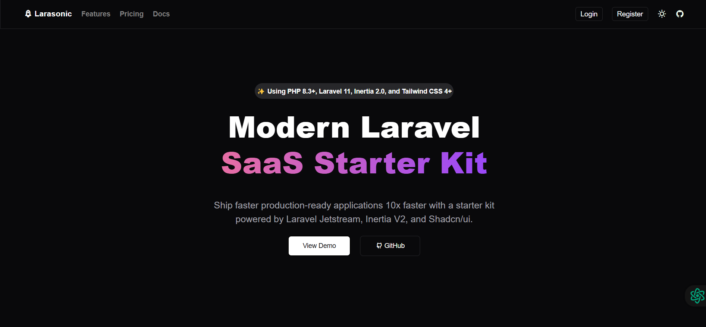

# Web Dev Projects

Welcome to my Web Development Projects repository! This repository contains various web development projects that showcase my skills and creativity. Each project is unique and demonstrates different aspects of web development, from design to functionality.Most are from FreeCampCode! Cheerss!
Co-authored-by: asperier-K9 <kingstonaura97@gmail.com>


## Projects
 
I designed a very simple and clean landing Herpage : DannyGa 


 
 
Tried to recreate the webpage design of Larasonic   



<p align="left">
  <a href='/CSS Project/project_heropage/'>
    
  </a>
  <a href='/Frontend Projects/12-restricted-textarea/'>
    
  </a>
</p>

### 1. Cafe Menu
A simple and elegant cafe menu page that lists various coffee and dessert items. The page is styled with CSS to create a visually appealing menu.


- **Technologies Used:** HTML, CSS
- **Files:** [index.html](Cafe%20Menu/index.html), [styles.css](Cafe%20Menu/styles.css)

### 2. Color Marker
A fun project that displays colored markers using CSS. Each marker is styled with gradients and shadows to create a realistic look.


- **Technologies Used:** HTML, CSS
- **Files:** [index.html](Color%20Marker/index.html), [styles.css](Color%20Marker/styles.css)

### 3. Demo Portfolio
A portfolio website template that showcases projects, skills, interests, and contact information. The design is modern and responsive.


- **Technologies Used:** HTML, CSS
- **Files:** [index.html](demo%20-%20portfolio/index.html), [styles.css](demo%20-%20portfolio/styles.css)

### 4. Single-Page CV
A single-page CV template that includes personal information, skills, education, and experience. The layout is clean and easy to read.


- **Technologies Used:** HTML, CSS
- **Files:** [index.html](Single-Page%20CV/index.html)

### 5. Rothko Painting
A creative project that mimics a Rothko painting using CSS. The painting consists of colored rectangles with various effects.


- **Technologies Used:** HTML, CSS
- **Files:** [index.html](Rothko%20Painting/index.html), [styles.css](Rothko%20Painting/styles.css)

### 6. Photo Gallery
A Project based on Flex box, to make a responsive photo gallery whichchanges based on each screen size.


- **Technologies Used:** HTML, CSS, Bootstrap
- **Files:** [index.html](./Photo%20Gallery/index.html), [styles.css](./Photo%20Gallery/styles.css)

### 6. Portfolio
A Bootstrap-based portfolio website that includes a hero section, custom cards, and feature sections. The design is responsive and professional.


- **Technologies Used:** HTML, CSS, Bootstrap
- **Files:** [index.html](portfolio/index.html), [styles.css](portfolio/styles.css)


## How to Use

1. Clone the repository:
   ```sh
   git clone https://github.com/your-username/Web-Dev-Projects.git
